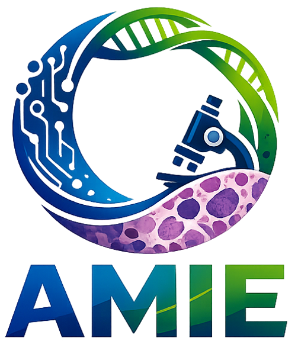

<table align="center" border="0px" cellspacing="0" cellpadding="0">
  <tr>
    <td width="150" align="center">
      
    </td>
    <td>
      <h1 align="center"> Detecting Extrachromosomal DNA from Routine Histopathology</h1>
		<table align="center">
			<tr>
				<td> 
					<a href="https://www.biorxiv.org/content/10.64898/2026.02.27.708546v1">
						
					</a>
				</td>
				<td>
					<a href="https://github.com/manwaarkhd/amie">
						
					</a>
				</td>
			</tr>
		</table>
    </td>
  </tr>
</table>

<p align="justify">
This repository contains the implementation of <b>AMIE</b>, an end-to-end multiple instance learning (MIL) framework to detect extrachromosomal DNA (ecDNA) from routine haematoxylin and eosin (H&E) whole-slide images (WSIs).
</p>

<!-- <div align="center">
  
</div>
<br>
<div align="center"> Overview of the AMIE framework for ecDNA-driven tumour detection from Whole-slide images. </div> -->


## Updates
- **02/03/2026**: Live on biorxiv.

# Usage Guide
## Prerequisites
- PyTorch 2.10
- OpenSlide 1.4
- OpenCV 4.13
- NumPy/pandas/SciPy/scikit-learn
## Installation
### 1. Clone the repository:
   ```bash
   git clone https://github.com/manwaarkhd/amie.git
   cd amie
   ```
### 2. Set up a Python virtual environment using `venv` (optional but recommended):
   ```bash
   python -m venv env
   source env/bin/activate
   ```
   On Windows:
   ```bash
   env\Scripts\activate
   ```
### 3. Install the required packages:
   ```bash
   pip install -r requirements.txt
   ```

# Citation
If you find our work useful in your research, please consider citing our paper:
```BibTeX
@article {Khalid2026.02.27.708546,
	author = {Khalid, Muhammad Anwaar and Gratius, Michael and Brown, Christopher and Younis, Raneen and Ahmadi, Zahra and Chavez, Lukas},
	title = {Detecting Extrachromosomal DNA from Routine Histopathology},
	year = {2026},
	doi = {10.64898/2026.02.27.708546},
	publisher = {Cold Spring Harbor Laboratory},
	journal = {bioRxiv}
}
```

# Acknowledgements
The authors acknowledge the support of the Ministry of Science and Culture of Lower Saxony through funds from the program zukunft.niedersachsen of the Volkswagen Foundation for the `CAIMed – Lower Saxony Center for Artificial Intelligence and Causal Methods in Medicine' project (grant no. ZN4257). The authors acknowledge Hannover Medical School for providing MHH-HPC resources and technical support that have contributed to the research results reported within this paper. 

